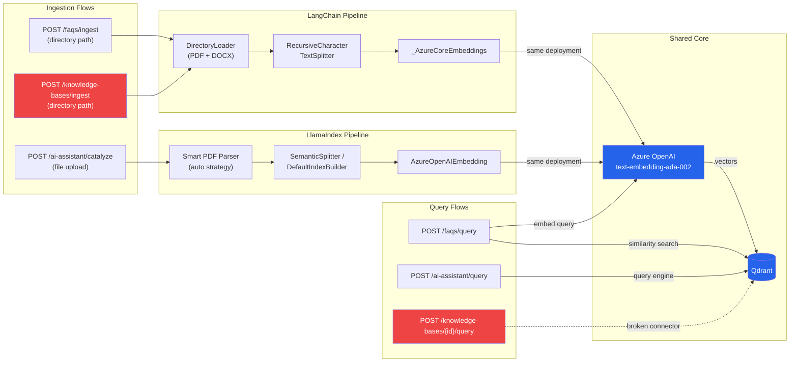

# AI Assistant — Data Flow (Ingest + Query)

## Notes

- **Blue** nodes = Shared infrastructure (Azure OpenAI + Qdrant)
- **Red** nodes = Broken / non-functional endpoints (`/knowledge-bases/` routes use `VectorDBConnector` which returns `None`)
- Both pipelines converge on the same Azure OpenAI embedding deployment, producing identical vectors
