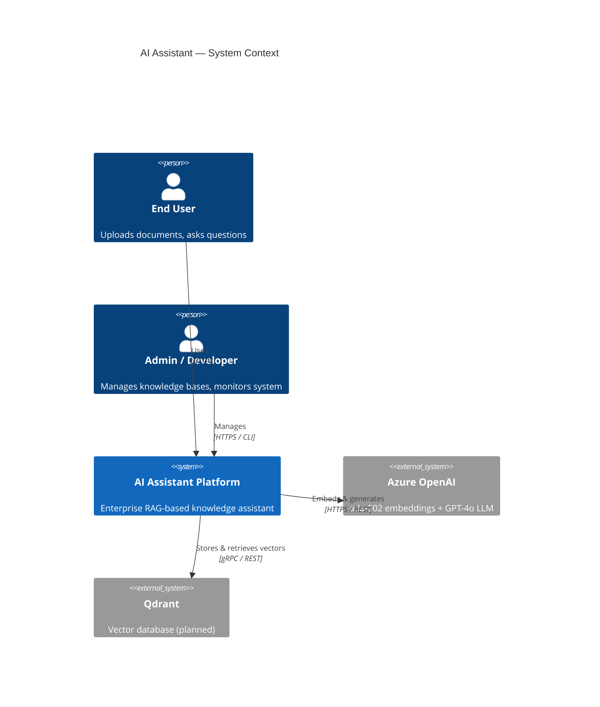
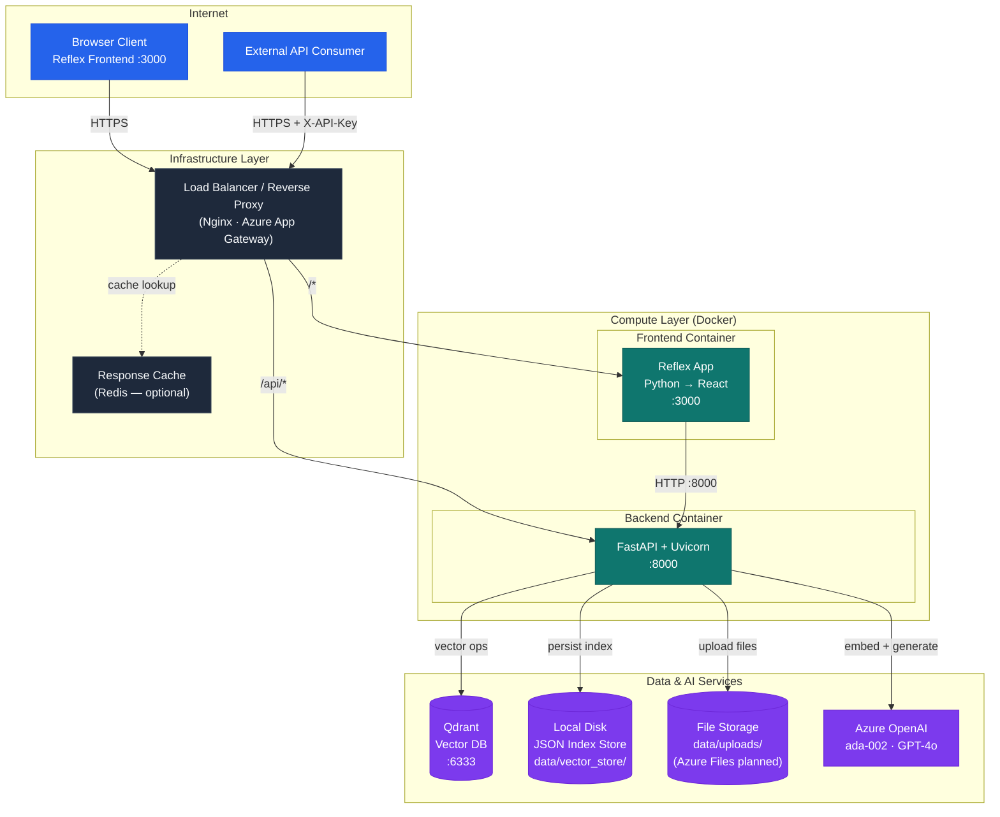
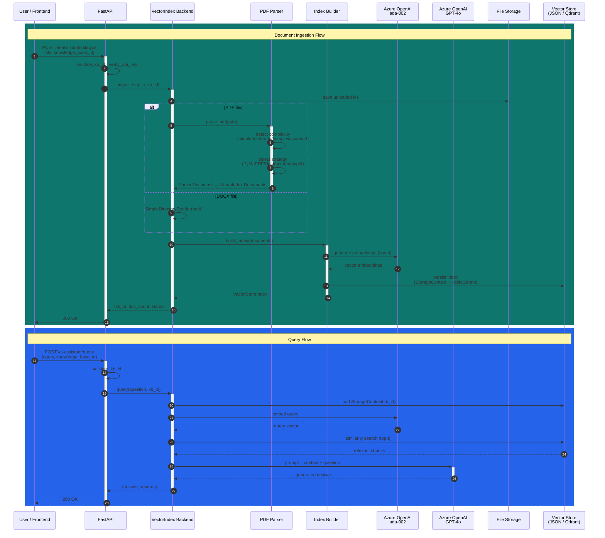
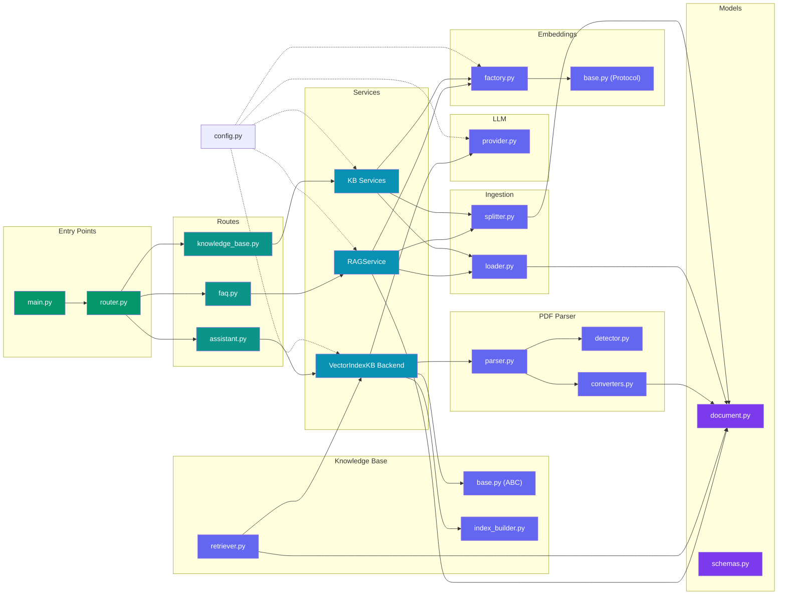

# AI Assistant — Production Architecture

---

## 1. System Context (High-Level)

---

## 2. Production Deployment Topology

---

## 3. Backend Component Architecture (Detailed)

```mermaid
graph TB
    %% ── Client Layer ────────────────────────────────────
    CLIENT(["Client<br/>(Reflex UI · cURL · Postman)"])

    %% ── API Layer ───────────────────────────────────────
    subgraph API["API Layer — FastAPI"]
        MAIN["main.py<br/>CORS · Uvicorn · Router mount"]
        ROUTER["api/router.py<br/>Global X-API-Key guard"]
        DEPS["dependencies.py<br/>verify_api_key<br/>validate_kb_id<br/>DI factories"]
        subgraph ROUTES["Route Handlers"]
            ASST_RT["/ai-assistant<br/>POST /catalyze (ingest)<br/>POST /query"]
            FAQ_RT["/faqs<br/>POST /ingest<br/>POST /query"]
            KB_RT["/knowledge-bases<br/>POST /ingest · POST /query<br/>⚠ broken — stub connector"]
            HEALTH["/health"]
        end
        SCHEMAS["models/schemas.py<br/>Pydantic request / response"]
    end

    %% ── Service Layer ───────────────────────────────────
    subgraph SERVICES["Service Layer"]
        VIB["VectorIndexKnowledgeBase<br/>Backend<br/>(LlamaIndex · persisted)"]
        RAG["RAGService<br/>(Protocol-based · in-memory)"]
    end

    %% ── RAG Pipeline ────────────────────────────────────
    subgraph PIPELINE["RAG Pipeline"]
        subgraph INGEST_PIPE["Document Ingestion"]
            LOADER["ingestion/loader.py<br/>ingest_documents()"]
            SPLITTER["ingestion/splitter.py<br/>TextSplitter Protocol<br/>RecursiveTextSplitter"]
        end
        subgraph PDF_PIPE["PDF Processing"]
            DETECTOR["detector.py<br/>profile_document()<br/>simple · moderate · complex · scanned"]
            PARSER["parser.py<br/>parse_pdf()<br/>PyMuPDF · Unstructured · pypdf"]
            CONVERTER["converters.py<br/>to_llamaindex_documents()<br/>to_langchain_documents()"]
        end
        INDEX["index_builder.py<br/>DefaultIndexBuilder<br/>SemanticIndexBuilder"]
        RETRIEVER["retriever.py<br/>KnowledgeBaseRetriever<br/>Protocol"]
    end

    %% ── Abstraction Layer ───────────────────────────────
    subgraph ABSTRACTIONS["Abstraction Layer (Protocols & ABCs)"]
        KB_BASE["base.py<br/>KnowledgeBaseBackend ABC<br/>ingest_file() · query()"]
        EMB_PROTO["embeddings/base.py<br/>EmbeddingProvider Protocol<br/>embed_documents() · embed_query()"]
        DOC_MODEL["models/document.py<br/>Document dataclass<br/>(framework-agnostic)"]
    end

    %% ── Framework Adapters ──────────────────────────────
    subgraph ADAPTERS["Framework Adapters"]
        EMB_FACTORY["embeddings/factory.py<br/>load_embedding_model()<br/>SentenceTransformer adapter"]
        LLM_PROV["llm/provider.py<br/>get_embed_model() — Azure ada-002<br/>get_llm() — Azure GPT-4o<br/>(LlamaIndex singletons)"]
    end

    %% ── Storage Layer ───────────────────────────────────
    subgraph STORAGE["Storage Layer"]
        JSON_STORE[("Local JSON Index<br/>data/vector_store/{uuid}/<br/>StorageContext persist")]
        FILE_STORE[("File Uploads<br/>data/uploads/")]
    end

    %% ── Qdrant Layer (configured, not wired) ────────────
    subgraph QDRANT_LAYER["Vector DB Layer (orphaned)"]
        QD_STORE["qdrant_store.py<br/>ensure_collection · upsert · search"]
        QD_PROV["qdrant_provider.py<br/>singleton Qdrant client"]
        VDB_CONN["connector.py<br/>VectorDBConnector<br/>⚠ stub — not implemented"]
    end

    %% ── External Services ───────────────────────────────
    AZURE_EMBED["Azure OpenAI<br/>text-embedding-ada-002"]
    AZURE_LLM["Azure OpenAI<br/>GPT-4o"]
    QDRANT_EXT[("Qdrant Server<br/>:6333")]

    %% ── Config & Utilities ──────────────────────────────
    CONFIG["config.py<br/>AppSettings dataclass<br/>(environment variables)"]
    subgraph UTILS["Utilities"]
        LOGGER["logger.py"]
        VALIDATORS["validators.py"]
        HELPERS["helpers.py"]
    end

    %% ══════════════════════════════════════════════════
    %% CONNECTIONS
    %% ══════════════════════════════════════════════════

    %% Client → API
    CLIENT -->|"HTTP :8000"| MAIN
    MAIN --> ROUTER
    ROUTER --> ROUTES
    DEPS -.->|"auth + DI"| ROUTES
    SCHEMAS -.-> ROUTES

    %% Routes → Services
    ASST_RT -->|Depends| VIB
    FAQ_RT -->|Depends| RAG
    KB_RT -.->|"Depends (broken)"| VDB_CONN

    %% VectorIndexKnowledgeBaseBackend path (primary)
    VIB -->|implements| KB_BASE
    VIB -->|"PDF files"| PARSER
    VIB -->|"DOCX files"| LOADER
    VIB -->|build index| INDEX
    VIB -->|"embed + LLM"| LLM_PROV
    VIB -->|persist| JSON_STORE
    VIB -->|upload| FILE_STORE

    %% RAGService path (secondary)
    RAG -->|load docs| LOADER
    RAG -->|chunk| SPLITTER
    RAG -->|embed| EMB_FACTORY
    RAG -->|uses| DOC_MODEL

    %% PDF pipeline
    PARSER --> DETECTOR
    PARSER --> CONVERTER
    CONVERTER --> DOC_MODEL

    %% Loader
    LOADER --> DOC_MODEL

    %% Abstractions
    EMB_FACTORY -->|implements| EMB_PROTO
    SPLITTER --> DOC_MODEL

    %% Adapters → Azure
    LLM_PROV -->|"REST API"| AZURE_EMBED
    LLM_PROV -->|"REST API"| AZURE_LLM

    %% Qdrant (orphaned path)
    QD_STORE --> QD_PROV
    QD_PROV -->|"gRPC / REST"| QDRANT_EXT

    %% Config fan-out (light)
    CONFIG -.-> MAIN
    CONFIG -.-> VIB
    CONFIG -.-> RAG
    CONFIG -.-> LLM_PROV
    CONFIG -.-> EMB_FACTORY
    CONFIG -.-> QD_STORE

    %% ══════════════════════════════════════════════════
    %% STYLING
    %% ══════════════════════════════════════════════════

    classDef api fill:#059669,color:#fff,stroke:#047857
    classDef service fill:#0891b2,color:#fff,stroke:#0e7490
    classDef pipeline fill:#0369a1,color:#fff,stroke:#075985
    classDef abstraction fill:#4f46e5,color:#fff,stroke:#4338ca
    classDef adapter fill:#7c3aed,color:#fff,stroke:#6d28d9
    classDef storage fill:#b45309,color:#fff,stroke:#92400e
    classDef external fill:#be185d,color:#fff,stroke:#9d174d
    classDef orphan fill:#6b7280,color:#fff,stroke:#4b5563
    classDef config fill:#374151,color:#e5e7eb,stroke:#4b5563

    class MAIN,ROUTER,DEPS,ASST_RT,FAQ_RT,KB_RT,HEALTH,SCHEMAS api
    class VIB,RAG service
    class LOADER,SPLITTER,DETECTOR,PARSER,CONVERTER,INDEX,RETRIEVER pipeline
    class KB_BASE,EMB_PROTO,DOC_MODEL abstraction
    class EMB_FACTORY,LLM_PROV adapter
    class JSON_STORE,FILE_STORE storage
    class AZURE_EMBED,AZURE_LLM,QDRANT_EXT external
    class QD_STORE,QD_PROV,VDB_CONN orphan
    class CONFIG config
```

---

## 4. RAG Data Flow (Ingestion + Query)

---

## 5. Module Dependency Graph

---

## 6. Legend

| Layer | Color | Components |
|-------|-------|------------|
| **API** | Green | FastAPI, routes, auth, dependencies, schemas |
| **Services** | Cyan | VectorIndexKnowledgeBaseBackend, RAGService |
| **RAG Pipeline** | Blue | loader, splitter, PDF parser, index builder, retriever |
| **Abstractions** | Indigo | KnowledgeBaseBackend ABC, EmbeddingProvider Protocol, Document dataclass |
| **Adapters** | Purple | embeddings/factory (LangChain), llm/provider (LlamaIndex) |
| **Storage** | Amber | JSON index store, file uploads |
| **External** | Pink | Azure OpenAI (ada-002 + GPT-4o), Qdrant |
| **Orphaned** | Gray | qdrant_store, qdrant_provider, VectorDBConnector (not wired) |
| Dashed lines | — | Config injection / weak dependencies |

---

## 7. Technology Stack Summary

| Layer | Technology | Status |
|-------|-----------|--------|
| Frontend | Reflex (Python → React) | Active |
| API | FastAPI + Uvicorn | Active |
| Auth | X-API-Key header (optional) | Active |
| Primary RAG | LlamaIndex VectorStoreIndex | Active |
| Secondary RAG | RAGService (Protocol-based, in-memory) | Active |
| Embeddings (prod) | Azure OpenAI text-embedding-ada-002 | Active |
| Embeddings (dev) | SentenceTransformer all-MiniLM-L6-v2 | Active |
| Embeddings (eval) | Qwen2 1.5B Instruct | Configured |
| LLM | Azure OpenAI GPT-4o | Active |
| Vector Store | Local JSON (StorageContext) | Active |
| Vector DB | Qdrant | Configured, not wired |
| File Storage | Local disk (data/uploads/) | Active |
| Deployment | Docker + docker-compose | Active |
| Load Balancer | Nginx / Azure App Gateway | Planned |
| Caching | Redis | Planned |

---

## 8. Scalability & Production Readiness Notes

1. **Horizontal scaling** — Stateless FastAPI containers behind a load balancer; sticky sessions not required since index loads from shared storage.
2. **Vector DB migration** — Switch `VECTOR_INDEX_STORAGE_MODE` from `hybrid` to `qdrant` to wire `qdrant_store.py` + `qdrant_provider.py` into the active pipeline.
3. **Caching** — Add Redis for repeated query results and embedding cache to reduce Azure OpenAI API calls.
4. **File storage** — Migrate `data/uploads/` to Azure Blob / Azure Files for durability and multi-container access.
5. **Observability** — Add OpenTelemetry tracing across the RAG pipeline (ingest → embed → index → query → generate).
6. **Rate limiting** — Add per-client rate limiting at the reverse proxy or via `slowapi` middleware.
7. **Health checks** — `/health` endpoint exists; extend with dependency checks (Qdrant connectivity, Azure OpenAI reachability).
